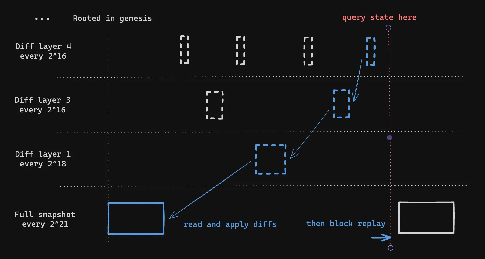

# State diffs in Prysm

The current document describes the implementation details and the design of hierarchical state diffs on Prysm. They follow the same design as [Lighthouse](https://github.com/dapplion/tree-states-review-guide/blob/main/persisted_hdiff.md) which in turn is an implementation of A. Nashatyrev's [design](https://hackmd.io/G82DNSdvR5Osw2kg565lBA). 

Incremental state diffs can be used both for databases and memory representations of states. This document focuses on the state diffs necessary for the first usage. Prysm already handles memory deduplication of states with multi value slices, thus a diff mechanism would result in less impact. 

## The basic design. 

The idea is to diagram the cold-state database as a forest:
- Each tree in the forest is rooted by a full state snapshot, saved every λ_0 slots (think once a year). 
- Each tree has the same height h. The root is unique and corresponds to the full snapshot, but on each level *1 ≤ i ≤ h*, there are β_i bifurcation nodes, which are stored every λ_i slots. Thus for example if we had *h = 2*, *λ_0 = 2^21*, *λ_1 = 2^18*, *λ_2 = 2^5*, we would have *β_1 = 7* and *β_2 = 8191* (notice that we subtract 1 since the first bifurcation node is just the state of the upper level). On the first level we would have 7 nodes written every ~36 days and on the second level we would have 8191 nodes written once every epoch. 
- At each level *1 ≤ i ≤ h*, in the *β_i* nodes that are stored, instead of writing a full state snapshot, we store the diff between the state at that given slot and the state corresponding to the parent node in level *i-1*. 



### Saving state diffs. 

Let us assume that we have a running node that already has an hdiff compatible database. That is, some snapshot with a full state is saved at some slot `o` (for *offset*). Suppose that we have just updated finalization, thus we have some blocks that we may need to save a state diff (or even a snapshot) for. Suppose we try for a block with slot `c`. Then at each of the slots

o, o + λ_0, o + 2 λ_0, ..., o + k_0 λ_0

we have a full snapshot state saved. We assume that o + (k_0+1) λ_0 > c, so that our latest snapshot is in fact at slot o + k λ_0. Let us call this state *s_0*. At each of the slots 

o + k_0 λ_0 + λ_1, o + k_0 λ_0 + 2 λ_1, ..., o + k_0 λ_0 + k_1 λ_1

we have stored a state diff between the state at that slot and *s_0*. We assume that 

o + k_0 λ_0 + (k_1+1) λ_1 > c

so that the latest diff at level one is in fact at slot o + k_0 λ_0 + k_1 λ_1. Let us call the sate at that slot *s_1*. it is obtained by applying the state diff saved at that slot to the state *s_0*. Similarly at the next level, for each slot

o + k_0 λ_0 + k_1 λ_1 + λ_2, o + k_0 λ_0 + k_1 λ_1 + 2 λ_2, ..., o + k_0 λ_0 + k_1 λ_1 + k_2 λ_2

we have stored a state diff to the state *s_1*. We assume that 

o + k_0 λ_0 + k_1 λ_1 + (k_2+1) λ_2  > c

so that the latest diff at level two is indeed at slot o + k_0 λ_0 + k_1 λ_1 + k_2 λ_2. Let us call the corresponding state *s_2*. It is obtained applying the last diff at level 2 to the state *s_1*, which in turn was obtained appplying a diff to the state *s_0*. 

We continue until we have covered all of our levels up to level h. That is we have states *s_0*, *s_1*, ..., *s_{h}* and the last one is the state at slot 

o + k_0 λ_0 + k_1 λ_1 + ... + k_h λ_h 

So now we want to decide what do to with our state *t* at slot c. We act as follows. If  o + k_0 λ_0 + k_1 λ_1 + ... + (k_h+1) λ_h > c. In this case we don't store anything. If on the other hand we have o + k_0 λ_0 + k_1 λ_1 + ... + (k_h+1) λ_h = c. In this case we will store either a state diff or an entire new snapshot. We proceed as follows. 

If k_h < β_h,  in this case we store a new state diff `Diff(s_{h-1},t)` at the slot c in level `h`. 

If k_h = β_h, we check the next level. If k_{h-1} < β_{h-1}, then we store a new state diff `Diff(s_{h-2},t)` at level `h-1` at the slot `c`. 

If k_{h-1} = β_{h-1} then we compare the next level: if  k_{h-2} < β_{h-2}, then we store a new state diff `Diff(s_{h-3}, t)` at level `h-2` at the slot `c`. 

We continue like this, if we reach the point in which all k_i = β_i for ì=1,...,h, then we store a new full snapshot with the state `t` at the slot `c`. 

### Triggering storage

When we update finalization, we call `MigrateToCold`, this function, instead of calling the database to store a full state every few epochs (as we do today), will send the state `t` at slot `c` as in the previous section, to save the corresponding diff. The package that handles state saving internally is the `database` package. However, the function `MigrateToCold` is aware of the values of the offset *o* and the configuration constants λ_1, ..., λ_h so as to only send the states `t` for which `c` is of the form `o + k λ_h`.

### Database changes

The database exposes the following API to save states

```
SaveState(ctx context.Context, state state.ReadOnlyBeaconState, blockRoot [32]byte) error
```

This functions will change internally to save just the diff or a snapshot if appropriate. On the other hand, the following is the API to recover a state:

```go
HasState(ctx context.Context, blockRoot [32]byte) bool
State(ctx context.Context, blockRoot [32]byte) (state.BeaconState, error)
```
The first function can return true now in a static manner according to the slot of the corresponing `blockRoot`, it simply checks that it is of the form o + k λ_h. The second function can recover those states by applying the corresponding diffs. 

Summarizing, the database has no changes in the exposed API, minimizing changes in the overal Prysm implementation, while the database internally changes the functions `State` and `SaveState` to use the `consensus-types/hdiff` package. This makes the serialization package fairly contained and only accessible from within the database package. 

### Stategen changes

The `stategen` package is respondible for the migration to cold database, it exposes the function 

```go
func (s *State) MigrateToCold(ctx context.Context, fRoot [32]byte) error {
```
that takes the finalized root and decides which states to save. This function is now changed to save only based on the slot of the state, for those slots that have the form o + k λ_h. A **warning** has to be said about missing blocks. Since the database will have to keep the state by slots now, a good approach in this function when there is a missing block at the corresponding slot, is to actually process the state to the right slot and save it already processed. 

Another function that needs to change minimally is the function
```
func (s *State) StateByRoot(ctx context.Context, blockRoot [32]byte) (state.BeaconState, error) 
```
That will get the ancestor from db simply by the slot rather than the root. 


### Longer term changes

We could change the database API to include getters and setters by slot in the cold database, since anyway this will keep only canonical states this would make things easier at the stategen level. 

### Configuration

We can make the constants h and λ_0, ... , λ_h user-configuratble. Thus, someone that is less storage constained and wants to run an archive RPC node, will set h higher and λ_h smaller (say 32 to save one diff every epoch), while a user that doesn't care about past states may even set `h=0` and not save anything. 

### Database migration

There is no migration support expected. 

### Startup from clean database

Starting up from a clean database and checkpoint sync will download the checkpoint state at slot o and set that slot as the offset in the database and save the first full snapshot with the checkpoint state. 

Starting up from a clean database and from genesis will set o = 0 and start syncing from genesis as usual. 

### Backfill

The following is added as an configurable option, pass the flag `--backfill-origin-state ssz`, in this case the node will download the state `ssz` and set as offset this state's slot. Will download the checkpoint state and start syncing forward as usual but will not call `MigrateToCold` until the backfill service is finished. In the background the node will download all blocks all the way up to the state ssz, then start forward syncing those blocks regenerating the finalized states and when they are of the form o + k λ_h. Once the forward syncing has caught up with the finalized checkpoint, we can start calling `MigrateToCold` again. This backfill mechanism is much faster than the current foward syncing to regenerate the states: we do not need to do any checks on the EL since the blocks are already finalized and trusted, the hashes are already confirmed. 

### Database Prunning

Currently we have a flag `--pruner-retention-epochs` which will be deprecated. Instead, the pruning mechanism is simply the following, the user specifies how many snapshopts wants to keep (by default 0 means keep all snapshots). If the user say specifies `--pruner-retention-snapshots 1`, then the node will delete everything in the database everytime we save a new snapshot every λ_0 slots. So in particular, a user that wants to keep its database to a minimum, it will set h=0, λ_0 to a very large value, and pass 1 to this flag, thus the node will only keep one state at any time and will not update it.


## Implementation details.

This section contains actual implementation details of the feature. It will be populated as pull requests are being opened with the final details of the implementation. For a high level design document please refer to [this previous section](#the-basic-design). 

### Serialization

The package `hdiff` located in `consensus-types/hdiff` is responsible for computing and applying state diffs between two different beacon states and serializing/deserializing them to/from a byte sequence.

#### Exported API

The only exported API consists of

```go
type HdiffBytes struct {
	StateDiff      []byte
	ValidatorDiffs []byte
	BalancesDiff   []byte
}


func Diff(source, target state.ReadOnlyBeaconState) (HdiffBytes, error)

func ApplyDiff(ctx context.Context, source state.BeaconState, diff HdiffBytes) (state.BeaconState, error)
``` 

The structure `HdiffBytes` contains three different slices that can be handled independently by the caller (typically this will be database methods). These three slices are the serialized and Snappy compressed form of a state diff between two different states. 

The function `Diff` takes two states and returns the serialized diff between them. The function `ApplyDiff` takes a state and a diff and returns the target state after having applied the diff to the source state. 

#### The `hdiff` structure

When comparing a source state *s* and a target state *t*, before serializing, their difference is kept in a native structure `hdiff` which itself consist of three separate diffs. 
```go
type hdiff struct {
	stateDiff      *stateDiff
	validatorDiffs []validatorDiff
	balancesDiff   []int64
}
```

The `stateDiff` entry contains the bulk of the state diff, except the validator registry diff and the balance slice diff. These last two are separated to be able to store them separatedly. Often times, local RPC requests are for balances or validator status, and with the hierarchical strcutrure, we can reproduce them without regenerating the full state. 

#### The `stateDiff` structure

This structure encodes the possible differences between two beacon states. 

```go
type stateDiff struct {
	targetVersion               int
	eth1VotesAppend             bool                                                        
	justificationBits           byte                                                        
	slot                        primitives.Slot                                             
	fork                        *ethpb.Fork                                                 
	latestBlockHeader           *ethpb.BeaconBlockHeader                                    
	blockRoots                  [fieldparams.BlockRootsLength][fieldparams.RootLength]byte  
	stateRoots                  [fieldparams.StateRootsLength][fieldparams.RootLength]byte  
	historicalRoots             [][fieldparams.RootLength]byte                              
	eth1Data                    *ethpb.Eth1Data                                             
	eth1DataVotes               []*ethpb.Eth1Data                                           
	eth1DepositIndex            uint64                                                      
	randaoMixes                 [fieldparams.RandaoMixesLength][fieldparams.RootLength]byte 
	slashings                   [fieldparams.SlashingsLength]int64                          
	previousEpochAttestations   []*ethpb.PendingAttestation                                 
	currentEpochAttestations    []*ethpb.PendingAttestation                                 
	previousJustifiedCheckpoint *ethpb.Checkpoint                                           
	currentJustifiedCheckpoint  *ethpb.Checkpoint                                           
	finalizedCheckpoint         *ethpb.Checkpoint                                           
	
	previousEpochParticipation []byte               
	currentEpochParticipation  []byte               
	inactivityScores           []uint64             
	currentSyncCommittee       *ethpb.SyncCommittee 
	nextSyncCommittee          *ethpb.SyncCommittee 
	
	executionPayloadHeader interfaces.ExecutionData 
	
	nextWithdrawalIndex          uint64                     
	nextWithdrawalValidatorIndex primitives.ValidatorIndex  
	historicalSummaries          []*ethpb.HistoricalSummary 
	
	depositRequestsStartIndex     uint64           
	depositBalanceToConsume       primitives.Gwei  
	exitBalanceToConsume          primitives.Gwei  
	earliestExitEpoch             primitives.Epoch 
	consolidationBalanceToConsume primitives.Gwei  
	earliestConsolidationEpoch    primitives.Epoch 

	pendingDepositIndex            uint64                            
	pendingPartialWithdrawalsIndex uint64                            
	pendingConsolidationsIndex     uint64                            
	pendingDepositDiff             []*ethpb.PendingDeposit           
	pendingPartialWithdrawalsDiff  []*ethpb.PendingPartialWithdrawal 
	pendingConsolidationsDiffs     []*ethpb.PendingConsolidation     
	
	proposerLookahead []uint64 
}
```

This type is only used internally when serializing/deserializing and applying state diffs. We could in principle avoid double allocations and increase performance by avoiding entirely having a native type and working directly with the serialized bytes. The tradeoff is readability of the serialization functions. 

#### The `validatorDiff` structure

This structure is similar to the `stateDiff` one, it is only used internally in the `hdiff` package in `consensus-types`

```go
type validatorDiff struct {
	Slashed                    bool             
	index                      uint32           
	PublicKey                  []byte           
	WithdrawalCredentials      []byte           
	EffectiveBalance           uint64           
	ActivationEligibilityEpoch primitives.Epoch 
	ActivationEpoch            primitives.Epoch 
	ExitEpoch                  primitives.Epoch 
	WithdrawableEpoch          primitives.Epoch 
}
```

#### The `balancesDiff`  slice

Given a source state `s` and a target state `t` assumed to be newer than `s`, so that the length of `t.balances` is greater or equal than that of `s.balances`. Then the `balancesDiff` slice inside the `hdiff` structure is computed simply as the algebraic difference, it's *i-th* entry is given by `t.balances[i] - s.balances[i]` where the second term is considered as zero if `i ≥ len(s.balances)`. 

#### Deserializing with `newHdiff` 

The function
```go
func newHdiff(data HdiffBytes) (*hdiff, error)
```
takes a serialized diff and produces the native internal type `hdiff`. This function encodes the internal logic for deserialization. It internally calls the functions ` newStateDiff`, `newValidatorDiffs`  and `newBalancesDiff`  to obtain the three inner structures. 

The main deserialization routines take the byte slices and they first decompress them with `snappy.Decode`. They create an empty `stateDiff`, `validatorDiff` or `balancesDiff` object `ret` and after that they pass a pointer to the decompressed byte slice `data` to helper functions `ret.readXXX(&data)` that populate each of the entries of `ret`. Here `XXX` corresponds to each of the entries in the beacon state, like `fork`, `slot`, etc. Each one of the helpers receives a pointer to the `data` slice that contains the byte slice of the diff that **is still yet to be deserialized**. The helper populates the corresponding entry in the hdiff structure and then modifies the `data` slice to drop the deserialized bytes. That is, each helper receives a slice that needs to be deserialized since its first byte. 

The following list documents the method that is used for serialization/deserialization of each entry

##### Version 

The version is stored as a little endian `uint64` in fixed 8 bytes of `data`. This version is the target version, that is, we override whatever the source state version is, with this target version. 

##### Slot

The slot is treated exactly the same as the version entry. 

##### Fork
The fork is deserialized as follows. If the first byte of `data` is zero (a constant called `nilMarker`  in the package) then the fork pointer is `nil` in the `hdiff` struture. If the first byte of `data` is not zero then the remaining bytes deserialize to a full `Fork` object. 

When applying the diff, if the fork pointer is `nil` then the source's Fork is not changed, while if it is not-nil, then the source's Fork is changed to whatever the `hdiff` pointer is. 

##### Latest Block Header

The latest Block header is treated exactly like the Fork pointer. 

##### Block Roots

The block roots slice is deserialized literally as a full slice of beacon block roots, this may seem like a large waste of memory and space since this slice is 8192 roots, each 32 bytes. However, the serialization process is as follows, if a blockroot has not changed between the source and the target state, we store a full zero root `0x00...`. For states that are *close by*, the block roots slice will not have changed much, this will produce a slice that is mostly zeroes, and these gets stored occupying minimal space with Snappy compression. When two states are more than 8192 slots appart, the target block roots slice will have to be saved in its entirety, which is what this method achieves. 

We could get a little more performance here if instead of keeping a full zeroed out root in the internal `hdiff` structure, we stored an empty slice. But this way the check for lengths becomes slightly more complicated. 

##### State Roots

The state roots slice is treated exactly like the block roots one. 

##### Historical Roots

The historical roots slice diff is stored as follows, the first 8 bytes store a little endian `uint64` that determines the length of the slice. After this, the following bytes contain as many 32 byte roots as this length indicates. Again, as in the previous root slices, if the root is not to be changed from the source state, we store a zero root.


##### Eth1 Data

The Eth1 Data diff object is treated exactly like the fork object. 

##### Eth1 Data Votes

The `stateDiff`  structure has two fields related to Eth1 data votes. The boolean entry `eth1VotesAppend` and a slice `eth1DataVotes`. The boolean indicates if the slice is to be *appended* to the source target or if the eth1 data vote slice needs to be completely replaced with the slice in the diff. 

Deserialization then goes as follows, if the first byte is `nilMarker` then `eth1VotesAppend`  is set to `True`, and `False`  otherwise. The following 8 bytes contain a `uint64` serialization of the length of the slice. The remaining bytes contain the serialized slice. 

##### Eth1 Deposit Index

This field always overrides the source's value. It is stored as an 8 bytes serialized `uint64`. 

##### Randao Mixes

This field is treated exactly like the block roots slice. 

##### Slashings

The slashings slice is stored as the algebraic difference between the target and the source state `t.slashings - s.slashings`. Thus the data is read as a sequence of 8 bytes serialized little Endian `int64`. When applying this diff to a source state, we add this number to the source state's slashings. This way, numbers are kept small and they snappy compress better.

##### Pending Attestations

Pending attestations are only present in Phase 0 states. So the paths to deserialize them (both for *previous and current epoch attestations*) is only executed in case the target state is a Phase 0 state (notice that this implies that the source state must have been a Phase0 state as well). 

For both of these slices we store first the length in the first 8 bytes. Then we loop over the remaining bytes deserializing each pending attestation. Each of them is of variable size and is deserialized as follows, the first 8 bytes contain the attestation aggregation bits length. The next bytes (how many is determined by the aggregation bits length) encode the aggregation bits. The next 128 bytes are the SSZ encoded attestation data. Finally the inclusion delay and the proposer index are serialized as 8 bytes `uint64`. 

##### Previous and Current epoch participation

These slices are there post Altair. They are serialized as follows, the first 8 bytes contain the length, and the remaining bytes (indicated by the length) are just stored directly as a byte slice. 

##### Justification Bits
These are stored as a single byte and they always override the value of the source state with this byte stored in the `hdiff` structure. 

##### Finalized and Previous/Current justified Checkpoints

These are stored as SSZ serialized checkpoints. 

##### Inactivity Scores

The first 8 bytes contain the little Endian encoded length, and the remaining bytes contain the `uint64` serialized slice. 

##### Current and Next Sync committees

If the first byte is 0, then the sync committee is set to be nil (and therefore the source's sync committee is not changed). Otherwise the remaining bytes contain the SSZ serialized sync committee. 

##### Execution Payload Header

This is serialized exactly like the sync committes. Notice that the implementation of `readExecutionPayloadHeader` is more involved because the SSZ serialization of the header depends on the state's version. 

##### Withdrawal Indices
The fields `nextWithdrawalIndex` and `nextWithdrawalValidatorIndex` are treated just like the `Slot` field. 

##### Historical Summaries

The first 8 bytes store the length of the list and the remaining bytes are stored as SSZ serializations of the summary entry. This slice is **appended** to the source state's historical summary state. 

##### Electra requests indices

The fields `depositRequestsStartIndex`, `depositBalanceToConsume`, `exitBalanceToConsume`, `earliestExitEpoch`, `consolidationBalanceToConsume` and `earliestConsolidationEpoch` are stored like the `Slot` field.

##### Pending Deposits

The first 8 bytes store the `pendingDepositIndex`, the next 8 bytes store the length of the pending deposit diff slice. The remaining bytes store a slice of SSZ serialized `PendingDeposit` objects. 

This diff slice is different than others, we store the extra index `pendingDepositIndex` in the `hdiff` structure that is used as follows. This index indicates how many pending deposits need to be dropped from the source state. The remaining slice is added to the end of the source state's pending deposits. The rationale for this serialization algorithm is that if taking the diff of two close enough states, the pending deposit queue may be very large. Between the source and the target, the first few deposits may have already been consumed, but the remaining large majority would still be there in the target. The target state may have some more extra deposits to be added in the end. 

Similarly, when computing the diff between the source and the target state, we need to find the index of the first deposit in common. We use the [Knuth-Morris-Pratt](https://en.wikipedia.org/wiki/Knuth%E2%80%93Morris%E2%80%93Pratt_algorithm) algorith to find it. 

Suppose that the source pending deposits are 

```
[A, B, C, D, E, F, G, H]
```

And the target pending deposits are
```
[C, D, E, F, G, H, I, J, K]
```

Then we will store `pendingDepositIndex = 2` and the diff slice will be 
```
[I, J, K]
```

##### Pending Partial Withdrawals

This field is treated exactly like the pending deposits. 

##### Pending Consolidations

This field is treated exactly like the pending deposits. 

##### Proposer Lookahead

The proposer lookahead is stored as the SSZ serialized version of the field. It always overrides the source's field. 

#### Applying a diff

The exported function

```go
func ApplyDiff(ctx context.Context, source state.BeaconState, diff HdiffBytes) (state.BeaconState, error)
```

Takes care of applying the diff, it first calls `newHdiff` to convert the raw bytes in `diff` into an internal `hdiff` structure, and then it modifies the `source` state as explained above returning the modified state. 

#### Computing a Diff

The exported function 
```go
func Diff(source, target state.ReadOnlyBeaconState) (HdiffBytes, error)
```
Takes two states and returns the corresponding diff bytes. This function calls the function `diffInternal` which in turn calls `diffToState`, `diffToVals` and `diffToBalances` that each return the corresponding component of an internal `hdiff` structure. Then we call `serialize()` on the correponding `hdiff` structure. The function `serialize` constructs the `data` byte slice as described above in the [Deserialization](#deserialization) section and finally it calls `snappy.Encode()` on each of the three slices. 
